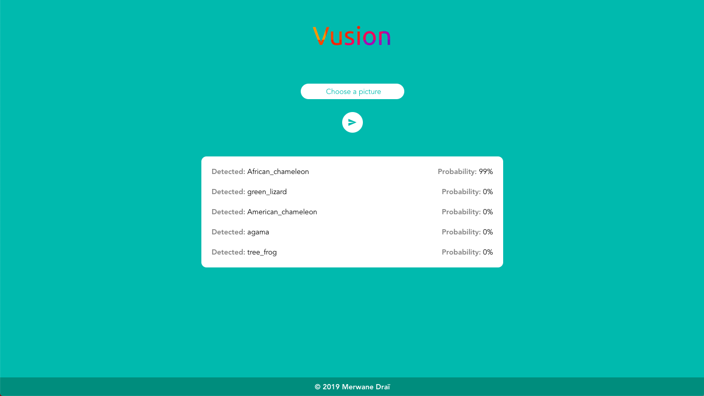
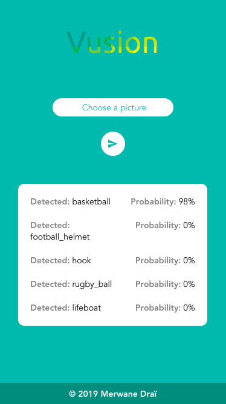

# Vusion
## Image analysis using AI 👁

<p align="center">

</p>

### Installation: (run both client & server simultaneously)
## client:
````bash
cd client

# Install dependencies
npm install

# Start dev server
npm run serve

````

## server:

````bash
cd server
pipenv shell

# Install dependencies (using Pipenv)
sudo pipenv install --skip-lock

# Start server with a category to detect
python server.py
````

### Demo:

<p align="center">


</p>
<p align="center">


</p>


### Donate:

Yeah. I know, I don't really deserve a donation for this tiny thing but here are my crypto addresses in case you're Jesus or just in case you want to support a 19 years old nerd.

* **Bitcoin**: 1GUZ5w7A9PEu8TNrvKfAAaqhABUPW4RjfS

* **Ethereum**: 0x56D6C69EC22Ee78A0454A165738A20a2e961385d

* **Bitcoin Cash**: qz5mle4x2vjelax2c0wxhuprq5ha63w4xsj0r38g8s
